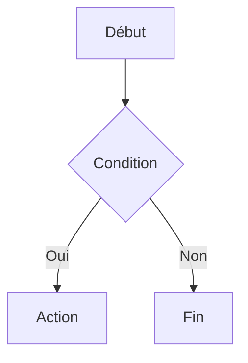

# Créer un post avec Jekyll Chirpy

> Documentation pour le thème [jekyll-theme-chirpy](https://github.com/cotes2020/jekyll-theme-chirpy)

---

## Table des matières

- [Nommer et placer le fichier](#1-nommer-et-placer-le-fichier)
- [Front Matter](#2-front-matter)
- [Options avancées](#3-options-avancées)
- [Contenu — blocs spéciaux](#4-contenu--blocs-spéciaux)
- [Images](#5-images)
- [Blocs de code](#6-blocs-de-code)
- [Diagrammes Mermaid](#7-diagrammes-mermaid)
- [Publier](#8-publier)

---

## 1. Nommer et placer le fichier

Crée un fichier dans le dossier `_posts/` à la racine du projet, en respectant ce format de nom :

```
YYYY-MM-DD-titre-du-post.md
```

**Exemple :**

```
_posts/2026-05-01-mon-premier-article.md
```

> L'extension doit être `.md` ou `.markdown`.

---

## 2. Front Matter

Chaque post doit commencer par un bloc YAML appelé *Front Matter*. Il contient les métadonnées du post.

```yaml
---
title: Mon titre ici
date: 2026-05-01 10:00:00 +0200
categories: [Catégorie, Sous-catégorie]
tags: [tag1, tag2]
---
```

| Champ        | Description                                        | Obligatoire |
| ------------ | -------------------------------------------------- | ----------- |
| `title`      | Titre du post                                      | ✅           |
| `date`       | Date et heure de publication (avec fuseau horaire) | ✅           |
| `categories` | Tableau de 1 ou 2 niveaux `[Parent, Enfant]`       | Recommandé  |
| `tags`       | Mots-clés en minuscules                            | Recommandé  |

Ensuite, le contenu du post s'écrit en **Markdown** juste après le bloc `---`.

---

## 3. Options avancées

### Épingler un post

Affiche le post en haut de la page d'accueil :

```yaml
pin: true
```

### Image de couverture

```yaml
image:
  path: /assets/img/mon-image.jpg
  alt: Description de l'image
```

> Résolution recommandée : **1200 × 630 px** (ratio 1.91:1)

### Désactiver les commentaires

```yaml
comments: false
```

### Désactiver le rendu Liquid

```yaml
render_with_liquid: false
```

### Définir l'auteur

```yaml
author: mon_auteur
```

> L'auteur doit être défini dans `_data/authors.yml`.

---

## 4. Contenu — blocs spéciaux

Chirpy propose des blocs d'alerte stylisés via des classes Markdown :

```markdown
> Ceci est un conseil.
{: .prompt-tip }

> Information importante.
{: .prompt-info }

> Soyez prudent.
{: .prompt-warning }

> Action dangereuse !
{: .prompt-danger }
```

**Rendu :**

| Classe            | Couleur | Usage           |
| ----------------- | ------- | --------------- |
| `.prompt-tip`     | Vert    | Astuce          |
| `.prompt-info`    | Bleu    | Information     |
| `.prompt-warning` | Jaune   | Avertissement   |
| `.prompt-danger`  | Rouge   | Danger / Erreur |

---

## 5. Images

### Image simple

```markdown

```

### Image avec légende et taille

```markdown
{: w="700" h="400" }
_Légende affichée sous l'image_
```

### Image alignée

```markdown
{: .normal }
{: .left }
{: .right }
```

> ⚠️ Quand une position est spécifiée, la légende ne s'affiche pas.

### Image dark/light mode

```markdown
{: .light }
{: .dark }
```

### Préfixe de chemin (media_subpath)

Si toutes tes images sont dans le même dossier, définis `media_subpath` dans le Front Matter pour éviter de répéter le chemin :

```yaml
media_subpath: /assets/img/posts/mon-article/
```

Puis utilise simplement :

```markdown

```

---

## 6. Blocs de code

### Syntaxe de base

````markdown
```python
print("Hello, world!")
```
````

### Avec nom de fichier

````markdown
```python
# filepath: src/main.py
print("Hello, world!")
```
````

### Sans numéros de ligne

````markdown
```bash
echo "Pas de numéros de ligne"
```
{: .nolineno }
````

> ⚠️ Le tag Jekyll `` n'est **pas compatible** avec Chirpy.

---

## 7. Diagrammes Mermaid

Active Mermaid dans le Front Matter :

```yaml
mermaid: true
```

Puis utilise la syntaxe suivante dans le contenu :

````markdown

````

---

## 8. Publier

### Avec GitHub Pages (recommandé)

1. Pousse le fichier sur ta branche principale (`main` ou `master`)
2. GitHub Actions se charge automatiquement de compiler et déployer le site

### En local

```bash
bundle exec jekyll serve
```

Le site est accessible sur `http://localhost:4000`.

---

## Exemple complet

```yaml
---
title: "Mon premier article avec Chirpy"
date: 2026-05-01 10:00:00 +0200
categories: [Tutoriel, Jekyll]
tags: [jekyll, chirpy, blog]
pin: false
image:
  path: /assets/img/posts/cover.jpg
  alt: Image de couverture
---

Bienvenue sur mon blog ! Voici mon premier article.

> Astuce : lisez bien la documentation officielle.
{: .prompt-tip }

## Section 1

Lorem ipsum...
```

---

*Documentation basée sur [jekyll-theme-chirpy](https://github.com/cotes2020/jekyll-theme-chirpy) — thème Jekyll par Cotes Chung.*
